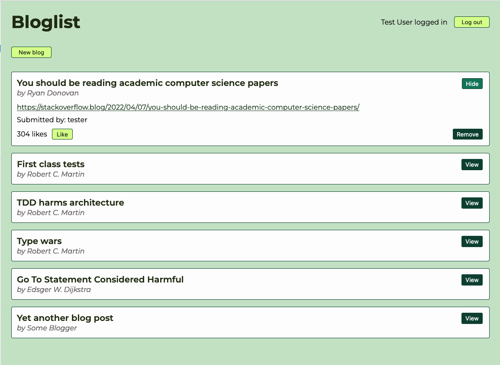

# FullStackOpen part 5: Bloglist frontend

This directory contains my solutions to [part 5 of Full Stack Open course](https://fullstackopen.com/en/part5), namely a React frontend for a bloglist backend built in part 4 [(see a separate repository)](https://github.com/Rikkokiri/FullStackOpen-bloglist).

This project was bootstrapped with [Create React App](https://github.com/facebook/create-react-app).

## Available Scripts

Scripts that you can run in the project directory include, but are not limited to the following. (See package.json for more)

### `npm start`

Runs the app in the development mode. Open [http://localhost:3000](http://localhost:3000) to view it in the browser.
However, for the app to function you need to also run backend at [http://localhost:3003](http://localhost:3003)

### `npm test`

Launches the test runner in the interactive watch mode. These are integration tests built with [Jest](https://jestjs.io) and [`react-testing-library`](https://github.com/testing-library/react-testing-library).

### `npm run cypress:open`

Launches Cypress UI for running end-to-end tests.\
For the tests to work, you need to also have frontend running (`npm start`) and start backend in test mode (`npm run start:test` in its own directory linked above).

### `npm run test:e2e`

Runs Cypress without the UI thus printing the test output to console. Required frontend and backend to be running as described above.

### `npm run build`

Builds the app for production to the `build` folder.\
It correctly bundles React in production mode and optimizes the build for the best performance.
